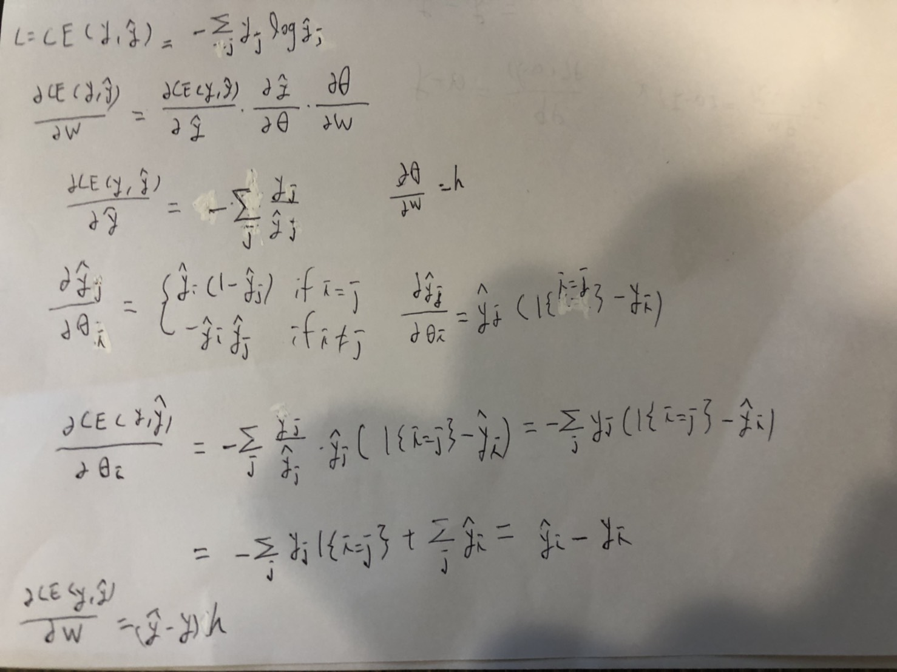

### Q1-1

Q1-2
1. F1-score is the harmonic of precision and recall, so it punishes extreme value more. To have high F1-score, you need to have both high precision and recall.
2. Because it is non-differentiable.
3. Bias描述預測值的期望與實際值的差距，偏差越大越偏離真實數據。
   Variance描述預測值變化範圍的離散程度，Variance越大，數據分布越分散。
4. In random forest, the data sample going to each individual tree has already gone through bagging, thus helps reduce overfitting and there's no need to prune the tree.
5. One-hot encoding is a process to convert categorical variables into a group of bits among which the legal combinations of values are only those with a single high (1) bit and all the others low (0).
6. Dropout, L1 or L2 regularization, early stopping, add more data.

